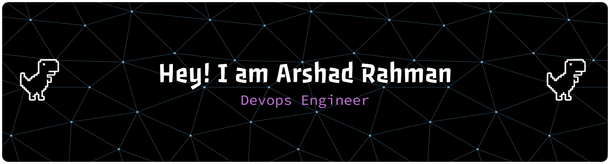

<div align="center">




</div>

<div align="center">

[](https://git.io/typing-svg)

</div>

<br/>

<div align="center">

[](https://www.linkedin.com/in/arshad-rahman-mp/)
[](https://github.com/arshad-rahman/arshad-rahman/)
[](mailto:arshadmp004@gmail.com)

</div>

<br/>

<div align="center">

```yaml
identity:
  name: "Arshad Rahman"
  role: "DevOps Engineer"
  location: "India 🇮🇳"
  status: "⚡ Open to opportunities"

expertise:
  cloud:         [ AWS, Infrastructure-as-Code, Cloud Architecture ]
  containers:    [ Docker, Kubernetes, Helm, Container Security ]
  automation:    [ Terraform, Ansible, Jenkins, GitHub Actions ]
  observability: [ Prometheus, Grafana, Log Management, Alerting ]
  scripting:     [ Python, Bash, Shell Automation ]
  databases:     [ MySQL ]
  os:            [ Linux (Primary), Ubuntu, CentOS ]

philosophy:
  - "Automate everything that can be automated"
  - "If it's not monitored, it doesn't exist"
  - "Infrastructure is code — treat it that way"
  - "Ship faster, fail safely, recover instantly"
```

</div>

<br/>

---

<br/>

<div align="center">

**`// TECH ARSENAL`**

[](https://skillicons.dev)

[](https://skillicons.dev)

</div>

<br/>

---

<br/>

<div align="center">


&nbsp;


</div>

<div align="center">


</div>

<br/>

---

<br/>

<div align="center">

**`// FEATURED PROJECTS`**

<br/>

<table>
  <tr>
    <td width="50%" valign="top">
      <h3><a href="https://github.com/arshad-rahman/hackowac-cicd-booking-app">🚀 HackoWAC CI/CD Booking App</a></h3>
      <p>End-to-end CI/CD pipeline for a production booking application using Jenkins, Docker & automated deployments.</p>
      
      
    </td>
    <td width="50%" valign="top">
      <h3><a href="https://github.com/arshad-rahman/docker-cleanup-script">🐳 Docker Cleanup Script</a></h3>
      <p>Automated Bash script to prune unused Docker images, containers, volumes and networks. Keeps hosts lean.</p>
      
      
    </td>
  </tr>
  <tr>
    <td width="50%" valign="top">
      <h3><a href="https://github.com/arshad-rahman/ssl-auto-renewal">🔐 SSL Auto Renewal</a></h3>
      <p>Automated SSL certificate renewal with Let's Encrypt, cron scheduling, and failure alerting via shell scripts.</p>
      
      
    </td>
    <td width="50%" valign="top">
      <h3><a href="https://github.com/arshad-rahman/ai-release-notes-generator">🤖 AI Release Notes Generator</a></h3>
      <p>AI-powered tool that auto-generates structured release notes from Git commit history using LLM integration.</p>
      
      
    </td>
  </tr>
</table>

</div>

---

<br/>

<div align="center">


</div>

<br/>

---

<br/>

<div align="center">

> **`"In a world of manual deploys, be the pipeline."`**

<br/>


&nbsp;


</div>


